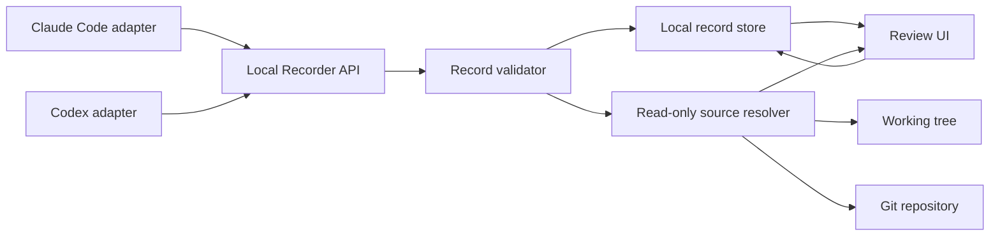

# AI生成コードレビュー支援ツール 設計仕様

- 日付: 2026-08-20
- 状態: 設計承認済み
- 対象: 個人開発者がAI生成コードとAIの判断を同時に検証するためのローカルツール

## 1. 問題と目的

AIコーディングエージェントはコード変更だけでなく、「この変更は安全」「既存の処理を壊さない」といった判断も生成する。現在は、コード・Git diff・AIの判断理由・実行確認が別々の場所に分かれ、判断がどのコードを指しているか、後から再現できるかを確認しにくい。

本ツールは、AIの意味のある判断を構造化して記録し、実ファイルまたはGitのrevisionにある対象コード、判断理由、確認結果、未確認事項を一つのレビュー画面で結びつける。

この仕様でいう「セキュリティ上の問題」は、実ファイルやGitを読み取る設計自体の安全性を指す。コードの脆弱性を自動検出するセキュリティスキャナはMVPの要件に含めない。

## 2. 利用者と成功条件

### 主利用者

AIに実装を任せた後、自分で変更内容とAIの判断を検証する個人開発者。

### MVPの成功条件

1. Claude Code用アダプターとCodex用アダプターが、同じ構造化判断記録をローカルRecorderへ送信できる。
2. Recorderが登録済みリポジトリの実ファイル、作業ツリー、Git revisionから判断対象を解決できる。
3. Review UIが、判断本文、対象ファイル・行、根拠、実行確認、未確認事項を同一画面で表示できる。
4. コードまたはrevisionのhashが変わった場合、現在のコードへ黙って付け替えず、対象変更または解決不能として表示できる。
5. デフォルトではコード本文と会話全文をプラグインから外部へ送信せず、Recorderは読み取り専用で動作する。
6. 未登録リポジトリ、ルート外パス、不正な記録、無効な認証を拒否できる。
7. Recorderの停止やGit解決失敗が、AIコーディング作業そのものを壊さない。

## 3. スコープ

### MVPに含めるもの

- ローカル完結型のRecorderサービス
- Claude Code用プラグインアダプター
- Codex用プラグインアダプター
- リポジトリ登録と読み取り範囲の管理
- 実ファイル、作業ツリー、Git diff、指定revisionの読み取り
- 構造化されたAI判断記録
- 判断記録とファイル・行・revision・hashの関連付け
- 判断タイムライン、リンクされたdiff、根拠表示
- ユーザーの最終判断をAIの判断と分離した記録
- 対象変更、解決不能、未登録パスなどの明示的なエラー表示
- 未コミット変更を再現するための変更ファイルまたはpatchの任意保存

### MVPに含めないもの

- クラウド保存、チーム共有、マルチユーザー権限
- AI会話ログの常時保存
- リポジトリ全体の常時スナップショット
- コードの脆弱性を自動検出するセキュリティスキャナ
- AIによる自動修正や自動マージ
- Recorderによるテスト、ビルド、Git hooks、任意コマンドの実行
- 特定のAIモデルの推論品質を評価する機能

## 4. アプローチ比較と採用方針

### ローカル完結型

プラグインは判断記録をローカルRecorderへ送り、Recorderが登録済みリポジトリからコードを読み取る。プライバシーと実装範囲のバランスが最もよく、採用する。

### Gitネイティブ型

判断記録をGit notesや専用ディレクトリへ保存する。コードとの移動性は高いが、リポジトリ汚染、マージ競合、秘密情報の誤コミットが発生しやすいため、MVPの保存先にはしない。

### クラウド型

判断記録やコードをAPIへ送る。共有性は高いが、ソースコード漏洩、認証、権限、保持期間、マルチテナント分離の範囲が大きくなるため、MVPでは採用しない。

### 決定

**ローカル完結型を標準とし、Aの参照情報を正規データとして保存する。Gitだけでは未コミット状態を再現できない場合に限り、Bの変更ファイルまたはpatchをローカルで任意保存する。Cの生会話ログは保存せず、プラグインが構造化した判断要約だけを扱う。**

## 5. システム構成



### 5.1 AIプラグインアダプター

Claude CodeとCodexそれぞれの出力を、共通の判断記録形式へ変換する薄いアダプター。コード本文や会話全文を送信せず、判断、対象参照、根拠、確認結果、未確認事項、revision情報を送信する。

アダプター固有のイベント形式やAI製品名はRecorderの内部モデルに漏らさず、共通形式へ変換する。

### 5.2 Local Recorder API

ローカル通信を受け付け、記録の形式、認証、リポジトリ、対象パス、revision、hash、冪等性を検証する。コード本文を受け取って保存するAPIはMVPの標準経路にしない。

Recorderは、記録処理の失敗をプラグインへ返すが、AIコーディング処理そのものを停止させない。
プラグインのMVP記録境界は、セッション終了時の構造化サマリーを最低1件記録することとする。アダプターが明示的な判断イベントを取得できる場合は複数件を記録してよい。トークン単位や全ツール呼び出し単位では記録しない。

### 5.3 Repository RegistryとSource Resolver

登録済みリポジトリの正規化済みルートを管理する。Source Resolverは、登録ルートと許可されたrevisionの範囲で、作業ツリー・Git diff・指定revisionを読み取る。読み取り中にファイルを書き換えたり、Git hooksや任意コマンドを実行したりしない。
プラグインが指定できるrevisionは、現在の作業ツリーまたはユーザーが明示的に選択したcommitに限定する。Recorderがプラグインの要求だけでGit履歴全体を走査してはならない。

### 5.4 Local Record Store

判断記録、対象参照、確認結果、ユーザーの最終判断、必要なhashをローカルに保存する。ソースコード本文と生会話ログは標準では保存しない。任意スナップショットは、ユーザーが明示した変更ファイルまたはpatchだけを別の保存領域へ置く。

### 5.5 Review UI

判断タイムライン、対象diff、ファイル・行への移動、根拠、確認結果、未確認事項を表示する。AIの判断とユーザーの最終判断を別の状態として扱う。対象hashが一致しない場合は現在のコードを同じ対象として表示しない。

## 6. 判断記録モデル

### 6.1 ReviewSession

一つのAIコーディング作業を識別する記録。

- `session_id`
- `repository_id`
- `agent_type`（Claude CodeまたはCodex）
- `started_at`
- `ended_at`
- `status`

### 6.2 DecisionRecord

AIが行った意味のある判断または主張を一件として記録する。会話の全メッセージ単位では保存しない。

- `record_id`
- `session_id`
- `repository_id`
- `revision`
- `targets[]`
- `judgment`
- `rationale`
- `checks[]`
- `open_questions[]`
- `created_at`
- `user_disposition`
`judgment`はAIの主張であり、ユーザーの承認結果ではない。`user_disposition`は未確認、確認済み、差し戻しの3つの状態から選び、人間側の状態をAIの判断と別に持つ。

### 6.3 TargetReference

コード本文を重複保存せず、判断対象を固定するための参照。

- `repository_id`
- `path`
- `line_start`
- `line_end`
- `revision_type`（commitまたはworking-tree）
- `revision_value`
- `content_hash`

コミット済みコードはcommit SHAと対象ファイルのblob hashを使う。未コミット変更は作業ツリーのcontent hashを使う。

### 6.4 SnapshotReference
スナップショットは対応する判断記録に紐づくローカルデータとし、外部へ自動送信しない。削除はユーザーの明示操作で行う。

任意機能。未コミット変更を後から再現する必要がある場合に、変更ファイルまたはpatchのローカル保存先を参照する。全リポジトリや会話ログの保存を意味しない。

## 7. データフローとライフサイクル

1. ユーザーがローカルツールへリポジトリを登録する。
2. AIプラグインがセッションとリポジトリIDを識別する。
3. AIが意味のある判断を出した時点で、アダプターが構造化記録を作る。
4. Recorderが認証、リポジトリ登録、対象パス、revision、記録形式を検証する。
5. Source Resolverが対象の現在状態または指定revisionを読み、hashを確認する。
6. 検証済み記録をLocal Record Storeへ保存する。必要な場合のみ変更ファイルまたはpatchを保存する。
7. Review UIが記録を解決し、判断と対象コードを同一画面へ表示する。
8. ユーザーが判断を確認、保留、または差し戻しとして記録する。
9. 後から対象ファイルまたはGit revisionが変わった場合、hash不一致を表示し、判断を新しいコードへ自動移動しない。

## 8. セキュリティ設計

### 8.1 ファイル読み取り境界

- Recorderは登録済みリポジトリだけを読み取る。
- プラグインから渡されたパスをそのまま開かず、`realpath`後に登録ルート配下か検証する。
- ルート外へ解決されるシンボリックリンクを拒否する。
- サブモジュールは別リポジトリとして明示登録する。
- `.git`の参照先も許可された範囲で扱う。

### 8.2 実行境界

- Recorderはファイルを変更しない。
- 取得処理中にGit hooks、ビルド、テスト、任意コマンドを実行しない。
- テストやコマンドの結果はプラグインから報告された記録として扱う。

### 8.3 通信と保存

- Recorderは127.0.0.1で待ち受ける。
- プラグインまたはセッション単位の認証トークンを使う。
- ブラウザUIからの書き込みはOrigin・CSRF境界を検証する。
- デフォルトではコード本文と会話全文をプラグインから外部へ送らない。
- スナップショット、会話ログ、外部エクスポートは明示操作とする。
- ログにコード本文、秘密情報、判断全文を不用意に出さない。

### 8.4 不信頼データ

リポジトリ内のコメント、README、テストデータ、ファイル名は不信頼なデータとして扱う。AIへ再提示する際、それらをツールポリシーやシステム命令として扱わない。Review UIではコード、Markdown、ファイル名をHTMLとして実行しない。

### 8.5 Git履歴

現在の作業ツリー、指定commit、必要なdiffを標準経路とし、Git履歴全体を自動取得しない。削除済み秘密情報が残る履歴を読む処理は明示操作に限定する。

### 8.6 重要な制約

このツールは、同じユーザー権限で動く他のローカルプロセスからOSレベルでユーザーのファイルを完全に隠すものではない。目的は、Recorderが任意パスを読んだり外部公開したりしてアクセス範囲を不用意に広げないことである。

## 9. エラー処理

| 状況 | 挙動 |
|---|---|
| 未登録リポジトリ | 記録を拒否し、登録が必要だと通知する |
| ルート外パス・危険なリンク | 読み取りを拒否し、対象を記録しない |
| revisionが存在しない | 判断記録は保持し、コードリンクを解決不能として表示する |
| content hash不一致 | 現在のコードへ自動付け替えせず、対象変更を表示する |
| Git読み取り失敗 | 判断記録を捨てず、コード解決待ちとして保存する |
| 不正な記録形式 | 受け付けず、フィールド単位のエラーを返す |
| Recorder停止中 | プラグイン側で構造化記録を短期間キューし、再送する |
| 同じ記録の再送 | `record_id`で冪等化し、重複表示しない |
| 大きすぎるファイル・diff | サイズ上限を適用し、対象外として明示する |

取得失敗やhash不一致を、現在のコードで黙って補正してはならない。レビュー対象と表示対象が異なる状態を明示することを優先する。
Recorder停止時の再送キューは構造化判断記録だけを対象とし、コード本文や会話ログを含めない。再送に失敗した記録は無期限に保持せず、ユーザーへ保存失敗を通知する。

## 10. テストと検証

### 10.1 プラグイン契約テスト

- Claude CodeとCodexの両アダプターが同じ形式へ変換できる
- 正常な判断記録を送信できる
- 必須フィールド欠落を拒否できる
- 不正なパスやrevisionを拒否できる
- 同じ`record_id`の再送が重複しない
- Recorder停止時に記録をキューし再送できる

AIモデルの推論品質はテスト対象にせず、固定した構造化記録を使用する。

### 10.2 Git・ファイル解決テスト

一時Gitリポジトリを使い、次を検証する。

- commit済みファイルを正しい行へリンクできる
- diff対象行を表示できる
- 未コミット変更をcontent hashで識別できる
- ファイル変更後にhash不一致を検出できる
- revision削除・書き換え時に解決不能を表示できる
- シンボリックリンクによるルート外読み取りを拒否できる
- 未登録サブモジュールを読まない
- Git hooksや任意コマンドを実行しない

### 10.3 Recorder統合テスト

- localhost以外からの接続を拒否する
- 不正な認証トークンを拒否する
- 未登録リポジトリを拒否する
- 登録済みルート外の読み取りを拒否する
- Git読み取り失敗時も判断記録を失わない
- 同じ記録を冪等に処理する

### 10.4 Review UI振る舞いテスト

- 判断記録から対象ファイル・行へ移動できる
- 判断理由、確認結果、未確認事項を表示できる
- hash不一致を警告できる
- 現在のコードへ黙って付け替えない
- コード、Markdown、ファイル名をHTMLとして実行しない
- ユーザーの最終判断をAIの判断と別に保存できる

### 10.5 最小E2Eシナリオ

```text
一時Gitリポジトリを作成
  → AIプラグイン相当の記録を送信
  → Recorderがrevisionと対象行を検証
  → Review UIで判断記録を開く
  → 対象コードと理由を確認
  → ファイルを変更
  → hash不一致の警告を確認
```

このE2Eシナリオは、Claude CodeやCodexの実装詳細から独立し、共通Recorderの正しさを検証する。

## 11. 主要な設計判断

- 保存の標準は参照情報であり、コード本文の複製ではない。
- 未コミット状態の再現が必要な場合だけ、変更ファイルまたはpatchをローカル保存する。
- 生のAI会話ログは保存せず、構造化判断記録を保存する。
- AIの判断とユーザーの最終判断を分離する。
- revisionまたはhashが一致しない場合、現在のコードへ黙って再関連付けしない。
- プラグインは薄いアダプターとし、検証・保存・コード解決は共通Recorderが担当する。
- Recorderは読み取り専用で、任意コマンドやGit hooksを実行しない。
- クラウド共有、脆弱性スキャン、全会話ログ保存はMVPの外部とする。
